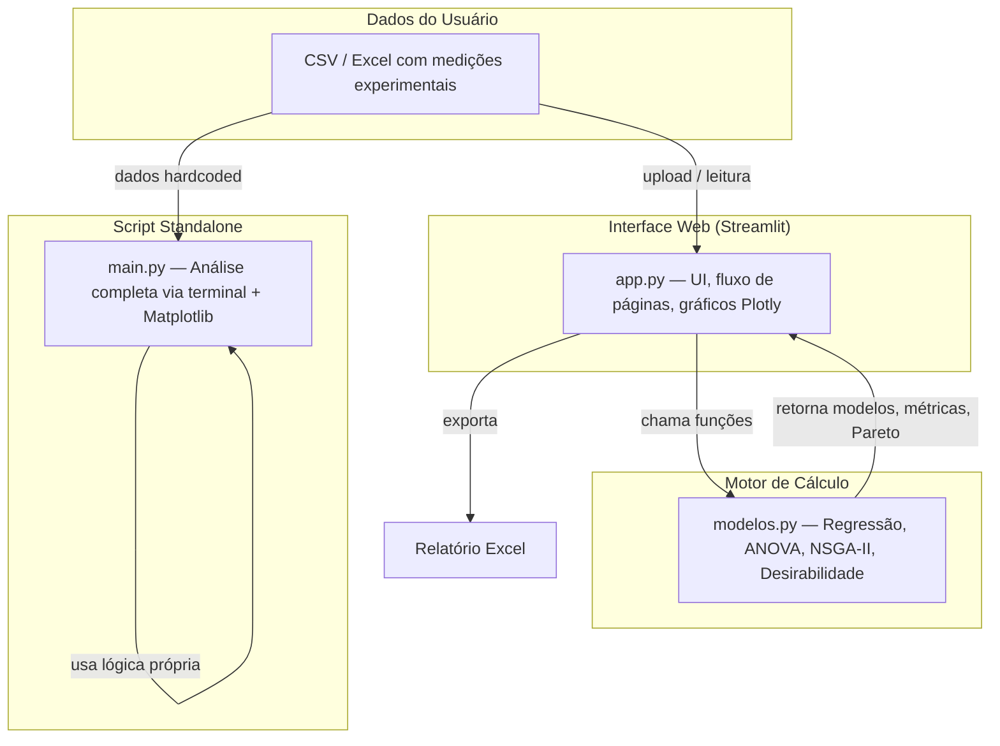
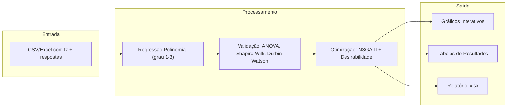
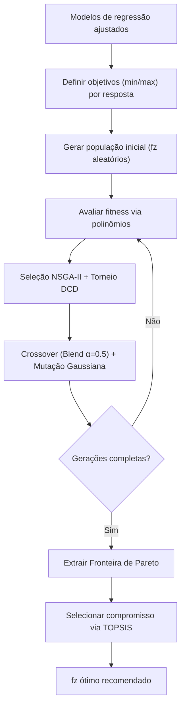

# 🔬 Otimização de Parâmetros de Microusinagem

Aplicativo interativo para análise estatística e otimização multiobjetivo de
parâmetros de microfresamento. Permite importar dados experimentais de DOE
unifatorial, ajustar modelos de regressão, validar estatisticamente e encontrar
o avanço por dente ótimo que minimiza rebarba e rugosidade simultaneamente.

---

## Tech Stack

| Tecnologia | Função |
|---|---|
| **Python 3.11** | Linguagem principal |
| **Streamlit** | Interface web interativa |
| **NumPy / SciPy** | Cálculos numéricos, regressão, testes estatísticos |
| **Pandas** | Manipulação de dados tabulares |
| **Plotly** | Gráficos interativos (regressão, Pareto, resíduos) |
| **Matplotlib** | Gráficos estáticos (script CLI) |
| **DEAP** | Algoritmo genético NSGA-II para otimização multiobjetivo |
| **OpenPyXL / XlsxWriter** | Importação e exportação de Excel |

---

## Arquitetura



---

## Fluxo de Dados



---

## Pipeline de Otimização (NSGA-II)



---

## Estrutura do Projeto

```
Microusinagem/
├── app.py              # Aplicativo Streamlit (interface principal)
├── modelos.py          # Funções: regressão, ANOVA, NSGA-II, desirabilidade
├── main.py             # Script CLI standalone (análise completa no terminal)
├── requirements.txt    # Dependências Python
├── README.md           # Este arquivo
├── main.txt            # (reservado)
├── assets/graficos_respostas.png  # Saída do main.py
├── assets/desirabilidade.png      # Saída do main.py
└── assets/boxplots.png            # Saída do main.py
```

---

## Módulos Principais

### `app.py` — Interface Streamlit

Seis seções sequenciais:

1. **Importação** — Upload CSV/Excel, template para download, dados de exemplo
2. **DOE** — Exibe estrutura do planejamento e estatísticas descritivas
3. **Regressão** — Ajuste automático (grau 1→N), seleção por R² ajustado, gráficos com IC 95%
4. **Validação** — ANOVA one-way, análise de resíduos (gráfico + QQ-plot + Durbin-Watson), Shapiro-Wilk
5. **Otimização** — Fronteira de Pareto via NSGA-II com TOPSIS + Função Desirabilidade
6. **Exportação** — Relatório Excel multi-abas

Sidebar: parâmetros fixos de corte, configuração do NSGA-II, grau máximo do modelo.

### `modelos.py` — Motor de Cálculo

| Função | Descrição |
|---|---|
| `ajustar_regressao(x, y, grau)` | Polyfit + R², R²adj, RMSE, IC 95% |
| `validar_modelo(x, y, coefs)` | R², RMSE, MAE, MAPE |
| `analise_residuos(x, y, coefs)` | Resíduos padronizados, Durbin-Watson, heterocedasticidade |
| `anova_one_way(grupos)` | F-test via `scipy.stats.f_oneway` |
| `teste_normalidade(dados)` | Shapiro-Wilk |
| `otimizacao_nsga2(...)` | NSGA-II completo com DEAP (população, crossover, mutação, seleção) |
| `desirabilidade_global(...)` | Derringer & Suich (1980) — média geométrica ponderada |
| `fronteira_pareto(pontos)` | Identificação de soluções não-dominadas |

### `main.py` — Script CLI

Versão standalone com dados hardcoded (ou editáveis), saída no terminal + gráficos `.png`.
Útil para execução rápida sem interface web.

---

## Desenvolvimento Local

### Pré-requisitos

- Python ≥ 3.11

### Setup

```bash
pip install -r requirements.txt
```

### Executar o app web

```bash
streamlit run app.py
```

Acesse em **http://localhost:8501**.

### Executar análise no terminal

```bash
python main.py
```

---

## Formato de Dados de Entrada

| Coluna | Tipo | Descrição |
|---|---|---|
| `fz` | float | Avanço por dente (µm/dente) — **obrigatória** |
| `repeticao` | int | Número da repetição (opcional) |
| `rebarba` | float | Área de rebarba (µm²) |
| `Ra` | float | Rugosidade média (µm) |
| `Rq` | float | Rugosidade RMS (µm) |
| `Rz` | float | Rugosidade média de picos (µm) |
| `Rt` | float | Rugosidade total (µm) |
| `Rsk` | float | Assimetria do perfil |
| `Rku` | float | Curtose do perfil |

Apenas `fz` e ao menos uma resposta são obrigatórias.

---

## Contexto do Estudo

- **Processo:** Microfresamento
- **Material da ferramenta:** Micro fresa de topo
- **Fator variável:** Avanço por dente (fz): 5, 10, 15, 20 µm/dente
- **Parâmetros fixos:** Profundidade de corte 20 µm, Rotação 20.000 rpm, Vel. corte 25,13 m/min
- **Respostas:** Área de rebarba (Image J) + Rugosidade (Ra, Rq, Rz, Rt, Rsk, Rku via perfilômetro Taylor Hobson)
- **Repetições:** 3 medições por canal (início, meio, fim)
